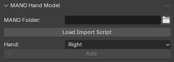
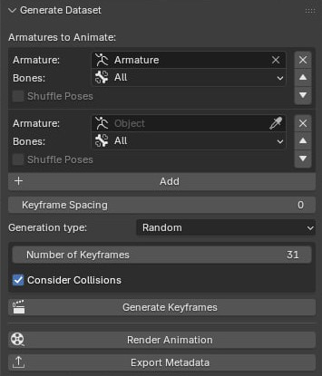
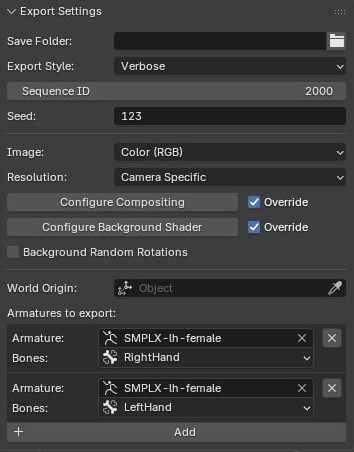
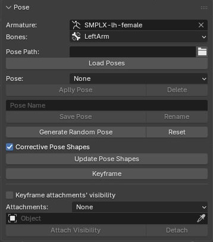
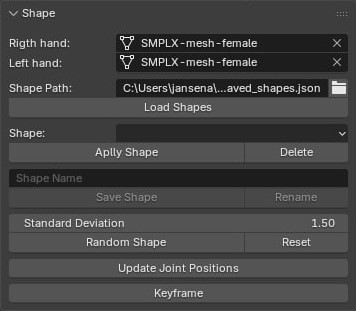
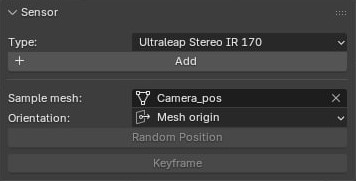
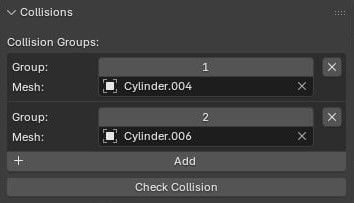

## Panels Overview
#### Import MANO Hand Model
Due to the licensing agreement the MANO model could not be shared within the add-on. The user has to manually provide the necessary files. 
For that, you would have to go to the [MANO website](https://mano.is.tue.mpg.de), register and download the .zip archive with the model. From the 'models' folder extract 'MANO_RIGHT.pkl' and 'MANO_LEFT.pkl'. Use the import script to generate .npz files (change input and output directory in the script).
Provide the folder with the newly generated .npz files in the add-on panel, and you are ready to add mano hands into the scene.

#### Generate Dataset
Select the armatures you want to generate the dataset with. If the predefined poses are used for the generation the resulting keyframes will contain all combination of poses.
You can change the order of the armatures. This will result in the change of frequency of the armature's poses across the timeline. Armatures to the bottom of the list will change more frequently.
By default the poses are keyframed in the order in which they were saved. During the keyframe generation they can be shuffled.

#### Export Settings
Provide dataset specific settings.
It is important to configure compositing and background shader for accurately rendered images.

#### Pose the Armature
Adjust the armature. Load and Save poses. Update the mesh based on the current pose (works only for mano and smplx). 
Each pose can have objects attached to it. During dedicated keyframing all attached objects will be set to render with the keyframed pose.

#### Shape the Mesh
Manipulate the shape of the hand. Load and save the shapes. Update the joints based on the generated hand mesh (works only for mano and smplx).
*For more precise shape manipulation use built-in shape keys*

#### Add Sensors
Add virtual sensors to the scene. By selecting them in the viewport or the outliner you can randomly position them on the vertices of the provided mesh.

#### Set Collisions
Set mesheshes as collissions. If they intersect the collision is detected. By assigning the same group number to different meshes the collision between them will be ignored.

